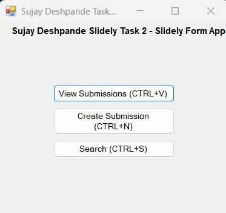
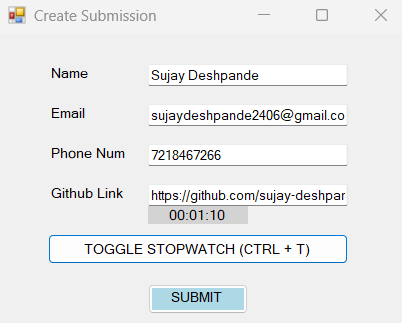
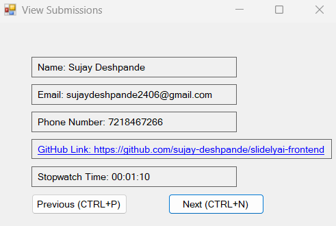
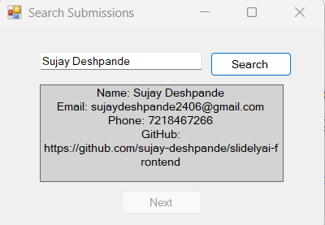

# Slidely Form Desktop App

This repository contains a Windows Desktop App created with Visual Basic for managing form submissions.

## Features

- Create New Submission form with fields for Name, Email, Phone Number, GitHub repo link, and a stopwatch.
- View Submissions form with navigation buttons (Previous and Next) to browse through previously submitted forms.
- Keyboard shortcuts for main actions (e.g., Ctrl + S for submitting the form).
- Additional features include options for searching the Submission.

## Getting Started

### Prerequisites

- Visual Studio with Visual Basic support.

### Installation

1. Clone the repository:

   ```bash
   git clone https://github.com/sujay-deshpande/slidelyai-frontend.git

2. Open the project in Visual Studio.

3. Build and run the project from Visual Studio.

### Usage
 - Create New Submission: Click on "Create New Submission" to fill out the form and submit details to the backend.
 - View Submissions: Click on "View Submissions" to navigate through previously submitted forms.
 - Keyboard Shortcuts: Use keyboard shortcuts as indicated in the application for quick actions.

### Connecting to Backend
This frontend interacts with a backend server for saving and retrieving submissions.
 - Ensure the backend server is running locally or hosted.
 - Update the backend URL in the frontend code (`MainForm.vb` or relevant file) to match your backend's endpoint.

#### Backend Repository
The backend for this application is located at https://github.com/sujay-deshpande/slidelyai-backend.git

## Output
<div style="display: flex; justify-content: space-around;">
  <div style="text-align: center;">
    
    <p><em>Screenshot of Front Page</em></p>
  </div>
  <div style="text-align: center;">
    
    <p><em>Screenshot of Submission Page</em></p>
  </div>
  <div style="text-align: center;">
    
    <p><em>Screenshot of Submission View</em></p>
  </div>
  <div style="text-align: center;">
    
    <p><em>Screenshot of Search Functionality</em></p>
  </div>
</div>
